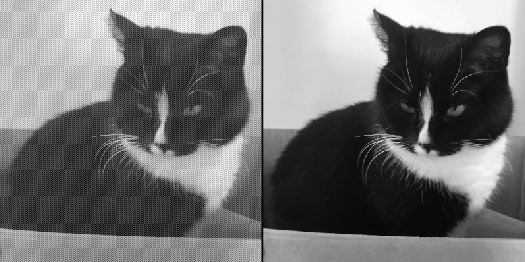
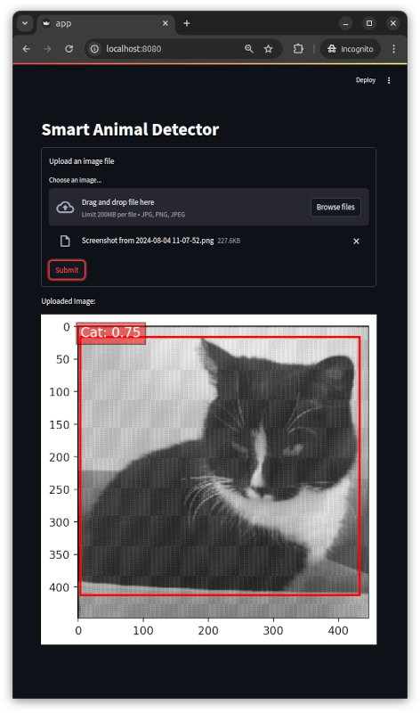

# Smart Animal Detector

Интеллектуальный сервис обнаружения животных на цифровых изображениях, в том числе зашумлённых. 

Детекция объектов реализована средствами библиотеки компьютерного зрения OpenCV,
шумоподавление — с помощью анализа сингулярного спектра в пакете Rssa.

Пример шумоподавления:<br>


Веб-интерфейс приложения:<br>


## Технологический стек

Java 17, Spring Boot, Spring Web Services, Thymeleaf, OpenCV, R, Rssa, Plumber, jsonlite, Apache Commons IO, Apache Commons Lang, Project Lombok, SLF4J, JUnit, Mockito, Apache Maven, git, Docker.

## Пререквизиты
- Для сборки требуется наличие Apache Maven и Docker.
- Компиляция кода и его исполнение c использованием Java 17.
- Необходимо предварительно установить библиотеку OpenCV 4 (https://opencv.org/).

## Сборка и запуск

- Сборка приложения при помощи Apache Maven командой
```shell
mvn clean package
```
- Вспомогательный сервис написан на R, упаковывается в docker-контейнер командой
```shell
docker build -t noise-reduction-server ./noise-reduction-server
```
- Запуск приложения осуществляется командой
```shell
docker run -d -e port=8081 noise-reduction-server
java -Djava.library.path=/path/to/opencv -jar target/detection-1.0.0.jar
```
  где `/path/to/opencv` – путь до бинарных файлов библиотеки OpenCV.

- Загрузка изображений осуществляется через веб-интерфейс на порту 8080 (можно изменить в application.yml).